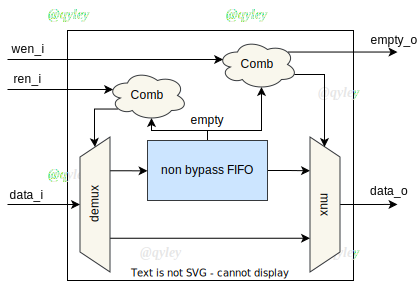

gnrc_fwft_fifo
------------------------------------------------
|
| Synchronous First-Word-Fall-Through FIFO
|
| This module need zero delay RAM(i.e read data can output instantly).
| Suitable for implementation of shallow depth FIFO in FPGA.
| If you need a deep depth FIFO, a `gnrc_fifo` or `gnrc_mem2fifo` is more porper.


Parameters
````````````````````````````````````````````````


.. csv-table::
 :header: "parameter", "datatype", "range", "description"
 :widths: 2, 2, 2, 4
 
 "DW", "int(default)", ">=1", "Data bit width"
 "DP", "int(default)", ">=1", "FIFO depth"
 "BYPASS", "bit", "{0,1}", "Bypass `data_i` to `data_o` when fifo is empty. If `BYPASS` activated, a combinational path exists between output and input. In the case of simultaneously read and write when FIFO is empty, data_o can derived directly from data_in. This feature is useful under some situations. However if you needn't this, set `BYPASS` = 0."
 


IOs
````````````````````````````````````````````````

.. csv-table::
 :header: "signal", "I/O", "width", "description"
 :widths: 2, 1, 2, 3
   
 "clk_i", "input", "logic", "Clock, positive edge triggered."
 "rst_ni", "input", "logic", "Asynchronous reset, active low."
 "flush_i", "input", "logic", "Clears all data in FIFO. flush can only clear registered data, **NO** effect on combinational path."
 "data_i", "input", "logic [DW-1:0]", "data input"
 "wen_i", "input", "logic", "write enable (push)"
 "ren_i", "input", "logic", "read enable (pop)"
 "full_o", "output", "logic", "FIFO full"
 "empty_o", "output", "logic", "FIFO empty"
 "data_o", "output", "logic [DW-1:0]", "data output"


First Word Fall Through
````````````````````````````````````````````````

此 FIFO 利用 分布式RAM 读数据0延迟的特性来实现 First Word Fall Through。
由于分布式RAM容量小，因此不适合将深度设置得太大。 几种模式的具体区别请见 :numref:`mem2fifo_t1` 。


Bypass
````````````````````````````````````````````````


通过设置 ``BYPASS`` 可以开启 BYPASS 模式，在 BYPASS模式下， FIFO 有类似 Latch 的特性。
当 FIFO 为空时，向 FIFO 写入的 ``data_i`` 会立刻出现在 ``data_o`` 上， ``empty_o`` 也会立刻清0。
该特性导致输入和输出之间存在组合逻辑路径，如图 :numref:`fwft_fifo_t0` 所示。


  
  BYPASS的数据旁路结构

如果对这种特性没有需求，请将 ``BYPASS`` 设置为0。

Flush
````````````````````````````````````````````````

正如 :numref:`fwft_fifo_t2` 所展示的一样，``flush_i`` 信号只对寄存器起作用，因此当 ``BYPASS`` 启用时，``flush_i`` 无法清除旁路上的组合逻辑的输出，这不是BUG，只是不需要这么做。


.. wavedrom::
    :name: fwft_fifo_t2
    :caption: flush a Bypass FIFO

    {
      signal: [
      {name: 'CLK',        wave: 'P..........', period:1},
      {name: 'data_i',     wave: 'x.=====x...',data:['d0','d1','d2','d3','d4']},
      {name: 'wen_i',      wave: '0.1....0...',},
      {name: 'flush_i',    wave: '0...1...0..',},
      {name: 'data_o',     wave: 'x.=..==x...',data:['d0','d3','d4']},
      {name: 'empty_o',    wave: '1.0....1...',}
      ],

      head: {},
      config: {hscale: 1},
      foot:{tock: 0}
    }