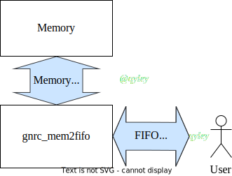

gnrc_mem2fifo
------------------------------------------------
|
| Convert a menory interface to FIFO interface
|

Notation:
 This module Need a dual-port memory 
 (like a simple dual-port RAM) connect from outside


Parameters
````````````````````````````````````````````````


.. csv-table::
 :header: "parameter", "datatype", "range", "description"
 :widths: 2, 2, 2, 4
 
 "DW", "int(default)", ">=1", "Data bit width"
 "DP", "int(default)", ">=2", "FIFO depth"
 "FWFT", "bit", "{0,1}", "1 to enable First Word Fall Through FIFO, 0 for Standard FIFO."
 "DELAY", "int(default)", ">=0", "latency of read of memory which equal to the depth of FWFT buffer, useless if `FWFT` is 0"
 "AW", "int(default)", "$clog2(DP)", "Address bit width (auto-gen, do **NOT** change)"
 "CW", "int(default)", "$clog2(DP+1)", "data counter bit width (auto-gen, do **NOT** change)"
 


IOs
````````````````````````````````````````````````

.. csv-table::
 :header: "signal", "I/O", "width", "description"
 :widths: 2, 1, 2, 3
   
 "clk_i", "input", "logic", "Clock, positive edge triggered. Must synchronous with memory's clock"
 "rst_ni", "input", "logic", "Asynchronous reset, active low."
 "fifo_flush_i", "input", "logic", "Clears all data in FIFO."
 "fifo_data_i", "input", "logic [DW-1:0]", "data input"
 "fifo_wen_i", "input", "logic", "write enable (push)"
 "fifo_ren_i", "input", "logic", "read enable (pop)"
 "fifo_full_o", "output", "logic", "FIFO full"
 "fifo_empty_o", "output", "logic", "FIFO empty"
 "fifo_data_o", "output", "logic [DW-1:0]", "data output"
 "fifo_cnt_o", "output", "logic [CW-1:0]", "number of data in FIFO , it may be **NOT** accurate in `FWFT` mode, and the scale of inaccuracy depends on the `DELAY` of the memory"
 "mem_wen_o", "output", "bit", "memory write enable"
 "mem_waddr_o", "output", "[AW-1:0]", "memory write address"
 "mem_wdata_o", "output", "[DW-1:0]", "memory write data"
 "mem_ren_o", "output", "bit", "memory read enable"
 "mem_raddr_o", "output", "[AW-1:0]", "memory read address"
 "mem_rdata_i", "input", "[DW-1:0]", "memory read data"


Usage
````````````````````````````````````````````````

`gnrc_mem2fifo` 模块可以将一个存储器接口转化为 FIFO 接口使用，便于利用自定义的存储器制造一块 FIFO。
 存储器需要具备两个独立的读、写通道。





First Word Fall Through
````````````````````````````````````````````````

 
`gnrc_mem2fifo` 支持 First Word Fall Through 配置。

:numref:`timing1` 和 :numref:`timing2` 展示了 FWFT FIFO 和标准 FIFO 的读写时序

.. wavedrom::
    :name: timing1
    :caption: FWFT FIFO的读写时序

    {
      signal: [
      {name: 'CLK',        wave: 'P..........', period:1},
      {name: 'data_i',     wave: 'x.=====x...',data:['d0','d1','d2','d3','d4']},
      {name: 'wen_i',      wave: '0.1....0...',},
      {name: 'ren_i',      wave: '0...1....0.',},
      {name: 'data_o',     wave: 'x.=..====x.',data:['d0','d1','d2','d3','d4']},
      {name: 'empty_o',    wave: '1.0......1.',}
      ],

      head: {},
      config: {hscale: 1},
      foot:{tock: 0}
    }

.. wavedrom::
    :name: timing2
    :caption: Standard FIFO的读写时序

    {
      signal: [
      {name: 'CLK',        wave: 'P..........', period:1},
      {name: 'data_i',     wave: 'x.=====x...',data:['d0','d1','d2','d3','d4']},
      {name: 'wen_i',      wave: '0.1....0...',},
      {name: 'ren_i',      wave: '0...1....0.',},
      {name: 'data_o',     wave: 'x....=====x',data:['d0','d1','d2','d3','d4']},
      {name: 'empty_o',    wave: '1.0......1.',}
      ],

      head: {},
      config: {hscale: 1},
      foot:{tock: 0}
    }


通过将 ``FWFT`` 参数设置为 1 来开启 First Word Fall Through 配置，开启后会在 `gnrc_mem2fifo` 内部额外生成一个 `skid_buffer` ，用于对 RAM 数据进行预取与缓存，使FIFO总是能很快地将最前端的数据准备在 ``data_o`` 端口上。 `skid_buffer` 通过例化 `gnrc_fwft_fifo` 实现。下图展示了实现的部分细节。

.. figure:: img/mem2fifo_fwft.svg


Data counter
````````````````````````````````````````````````

在 FWFT 模式下，由于 `skid buffer` 的存在，FIFO 内的 data counter 计数可能会不准，如果要进行准确计数请在外部自己写个计数器来记。

