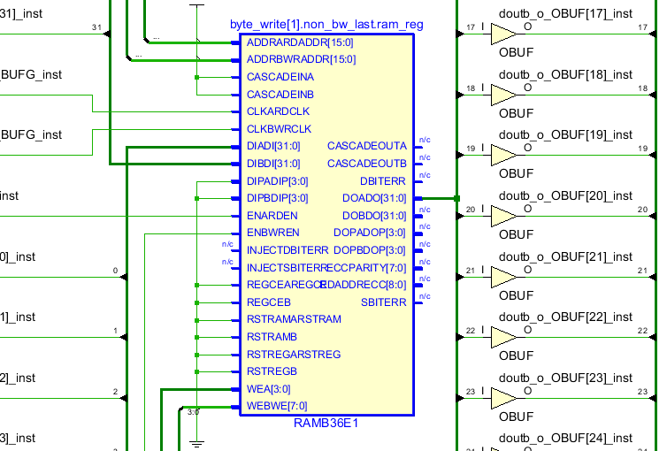
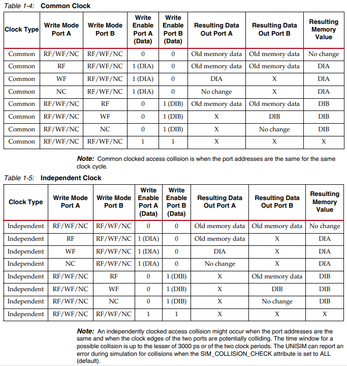

gnrc_true_dpram
------------------------------------------------
Ture dual-port RAM.

This can be sythesis as BlockRAM primitive automatically in FPGA.


Parameters
````````````````````````````````````````````````

.. csv-table::
   :header: "parameter", "datatype", "range", "description"
   :widths: 2, 2, 2, 4
   
   "DW", "int(default)", ">=1", "Data bit width"
   "DP", "int(default)", ">=1", "RAM depth"
   "DELAY", "int(default)", ">=1", "RAM delay for simulation, It's recommended set DELAY = 1 in synthesis, otherwise a DFF chain of (DELAY-1) length will be implement between BRAM and dout"
   "OP_MODE", "int(default)", "{0,1,2}", "Operationg Mode, 0 for Write-First, 1 for Read-First, 2 for No-Change. **ONLY** support Read-First when BYTE_WRITE enable"
   "BYTE_WRITE", "int(default)", "{0,1}", "Set 1 to enable byte write"
   "INIT_BY_ZERO", "int(default)", "{0,1}", "Set 1 to initialize ram by zero"
   "INIT_BY_FILE", "int(default)", "file path", "Initialize ram by a hex file, the initial value can also be downloaded to FPGA. Leave this empty to disable."
   "AW", "int(default)", "$clog2(DP)", "Address bit width (auto-gen, do **NOT** change)"
   "MW", "int(default)", "$ceil(DW/8) if BYTE_WRITE, 1 otherwise", "Write enable bit width (auto-gen, do **NOT** change)"
   


IOs
````````````````````````````````````````````````


.. csv-table::
   :header: "signal", "I/O", "width", "description"
   :widths: 2, 1, 2, 3
   
   "clka_i", "input", "logic", "port A clock input"
   "dina_i", "input", "logic [DW-1:0]", "port A data input"
   "ena_i", "input", "logic", "port A enable input"
   "wea_i", "input", "logic [MW-1:0]", "port A write enable input"
   "addra_i", "input", "logic [AW-1:0]", "port A read/write address input"
   "douta_o", "output", "logic [DW-1:0]", "port A data output"
   "clkb_i", "input", "logic", "port B clock input"
   "dinb_i", "input", "logic [DW-1:0]", "port B data input"
   "enb_i", "input", "logic", "port B enable input"
   "web_i", "input", "logic [MW-1:0]", "port B write enable input"
   "addrb_i", "input", "logic [AW-1:0]", "port B read/write address input"
   "doutb_o", "output", "logic [DW-1:0]", "port B data output"
   
Primitive
````````````````````````````````````````````````

gnrc_true_dpram根据Xilinx RAMB36原语的功能进行的编写，其功能是RAMB36的一个子集，满足大多数场景下使用parameter例化RAM的需求，比使用IP Catalog或者直接使用原语更方便一些。

gnrc_true_dpram可以被自动识别为RAMB36 IP。



OP_MODE
````````````````````````````````````````````````

每个端口有3种操作模式：

+ Write first
+ Read first
+ No change

操作模式会决定单个RAM端口在进行写数据操作时，输出数据的内容。

Write first
   写操作对应的输出为该地址被写入的数据（透传）。

Read first
   写操作对应的输出为该地址写入前的数据（一定程度避免丢数，但增加功耗）。

No change
   写操作对应的输出会保持上个时钟周期的数值。


Collision
````````````````````````````````````````````````

双口RAM同时对同一地址进行访问将造成冲突。


发生冲突时导致的RAM的输出和存储内容改变情况如下表所示 [#]_ 




.. [#] ref: ug473(https://docs.xilinx.com/v/u/en-US/ug473_7Series_Memory_Resources)
